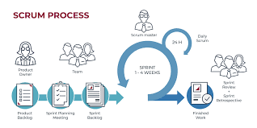
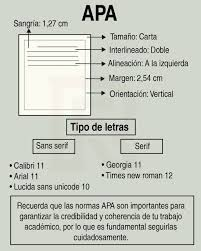
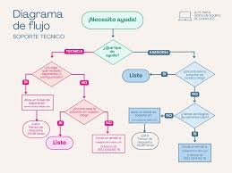

# 📘 Manual de Organización y Buenas Prácticas para Proyectos de Ingeniería

## Introducción
El presente manual tiene como objetivo establecer un marco de trabajo estandarizado para la ejecución de proyectos colaborativos. Ante la complejidad del desarrollo de software y sistemas automatizados, se requiere una metodología estricta que garantice la trazabilidad, la integración continua y la calidad académica en cada fase del ciclo de vida del proyecto.

## 1. Gestión del Tiempo y Metodologías Ágiles (Framework Scrum)
Para evitar los cuellos de botella y la sobrecarga técnica al final del semestre, el equipo adoptará el framework **Scrum**. Este enfoque iterativo e incremental permite una adaptación rápida a los cambios en los requisitos del proyecto.

### 1.1. Artefactos y Roles del Proyecto
* **Product Owner:** Encargado de maximizar el valor del producto y gestionar el Product Backlog.
* **Scrum Master:** Responsable de asegurar que el equipo comprenda y aplique la teoría y práctica de Scrum, eliminando impedimentos técnicos.
* **Equipo de Desarrollo:** Profesionales auto-organizados encargados de la ejecución.

### 1.2. Eventos y Ciclo de Trabajo Recomendado
1. **Sprint Planning:** Sesión donde se define el objetivo del Sprint y se seleccionan los elementos del Product Backlog (PBIs).
2. **Daily Scrum:** Revisión diaria para sincronizar actividades y crear un plan de 24 horas.
3. **Sprint Review:** Inspección del incremento de producto al final del Sprint.
4. **Sprint Retrospective:** Análisis de la eficiencia de las herramientas y procesos internos.

*Figura 1. Flujo de trabajo y artefactos del marco Scrum.*

## 2. Políticas de Comunicación y Gestión de Conflictos
El éxito del control de versiones radica en la comunicación. El desarrollo técnico asíncrono exige políticas claras para evitar la pérdida de información y la duplicación de esfuerzos.

### 2.1. Canales Oficiales y Trazabilidad
* **Comunicación Informal:** Exclusivamente para notificaciones rápidas y coordinación de horarios. No se tomarán decisiones de arquitectura por este medio.
* **Comunicación Formal:** Todo bug, feature, o tarea debe estar registrada en el tablero Kanban. Las decisiones técnicas deben quedar documentadas en los comentarios de los Pull Requests (PRs).

### 2.2. Resolución de Conflictos (Merge Conflicts)
Cuando dos desarrolladores alteran la misma línea de código, el protocolo a seguir es:
1. No forzar los merges (`git push -f` está estrictamente prohibido).
2. Aislar el conflicto mediante un entorno local.
3. Comunicar al autor del commit paralelo para consensuar la versión final del bloque de código.

## 3. Normativas de Formato y Rigor Académico
La presentación de la documentación adjunta a los repositorios o entregables finales debe cumplir con estándares formales de publicación científica.

### 3.1. Estándares de Documentación Textual
* **Tipografía y Tamaño:** Times New Roman a 12 puntos, o Arial a 11 puntos.
* **Márgenes e Interlineado:** Márgenes uniformes de 2.54 cm en todos los bordes de la hoja. Interlineado a doble espacio (2.0).
* **Alineación y Sangría:** Alineación a la izquierda, con sangría de primera línea a 1.27 cm.

*Figura 2. Especificaciones de formato general según normas APA.*

## 4. Ecosistema Colaborativo y Control de Versiones
El pilar de la colaboración técnica es un control de versiones impecable mediante Git.

### 4.1. Flujo de Trabajo (Git Flow simplificado)
1. **Rama `main` (Producción):** Contiene código y documentación 100% funcional y revisada. Nadie hace commits directos a `main`.
2. **Ramas de Características (`feature/`):** Cada desarrollador creará una rama derivada de `main` para trabajar en su sección específica sin alterar el proyecto global.
3. **Pull Requests (PR) y Code Review:** Todo código debe pasar por un PR, y debe ser revisado por al menos un compañero antes de fusionarse.

### 4.2. Citación de Herramientas y Bibliografía (APA 7ma Edición)
Cualquier dependencia, librería o texto teórico utilizado debe ser citado rigurosamente.
* **Formato para Libros:** Apellido, A. A. (Año). *Título de la obra*. Editorial.
* **Formato para Documentación Web:** Nombre del Proyecto. (Año). *Título del documento oficial*. URL.

*Figura 3. Diagrama de flujo para toma de decisiones de soporte.*

---

## Instrucciones de Uso y Contribución
Para hacer uso de este manual y contribuir al repositorio oficial del proyecto, siga los siguientes pasos estandarizados:
1. Clone el repositorio en su entorno local mediante el comando `git clone`.
2. Cree una nueva rama descriptiva para su aporte: `git checkout -b feature/nombre-de-su-mejora`.
3. Realice los cambios necesarios en la documentación o código, asegurándose de seguir las normativas de formato de este manual.
4. Empaquete y suba sus cambios con mensajes de commit claros: `git add .`, seguido de `git commit -m "Descripción del cambio"`, y finalmente `git push origin feature/nombre-de-su-mejora`.
5. Abra un Pull Request (PR) en GitHub detallando su aporte para que el equipo lo revise, apruebe y fusione a la rama principal.